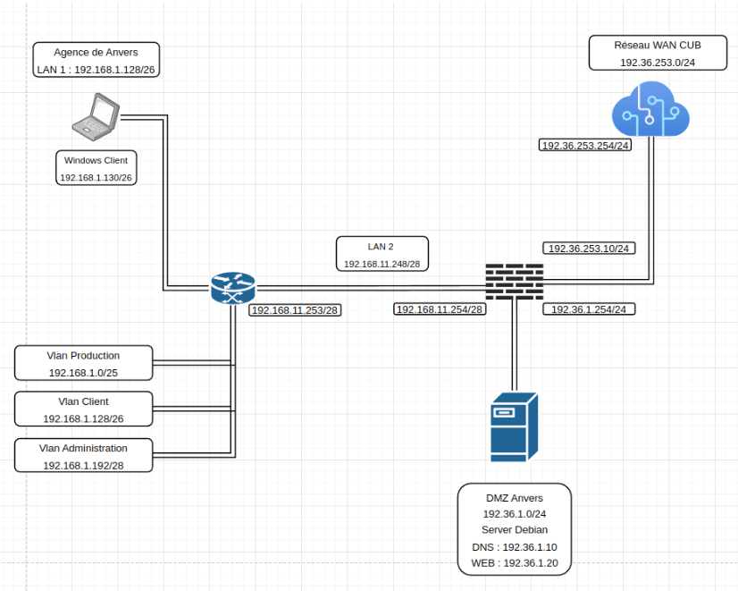
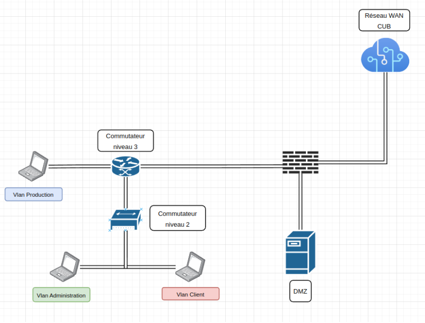

# Situation n°0 CUB – Plan d'adressage / Schéma logique & physique / Table de routage / NAT

**Auteur :** Andy REMY  
**Date de création :** 15/10/2025  

---

# Administration des systèmes

## Sommaire
1. [Nouveau plan d’adressage](#nouveau-plan-dadressage)
2. [Schéma logique](#schéma-logique)
3. [Schéma physique](#schéma-physique)
4. [Table de routage](#table-de-routage)
5. [Switch niveau 3](#switch-niveau-3)
6. [Pare-feu](#pare-feu)
7. [Avant translation](#avant-translation)
8. [Après translation](#après-translation)

---

## Nouveau plan d’adressage

### 🏭 Production
| Type | Binaire | Décimal |
|------|----------|----------|
| **IP** | `11000000.10101000.00000001.00000000` | 192.168.1.0 |
| **Masque de sous-réseau** | `11111111.11111111.11111111.10000000` | 255.255.255.128 |
| **Adresse de diffusion** | `11000000.10101000.00000001.01111111` | 192.168.1.127 |
| **Passerelle** | `11000000.10101000.00000001.1111110` | 192.168.1.126 |

---

### 💻 Client
| Type | Binaire | Décimal |
|------|----------|----------|
| **IP** | `11000000.10101000.00000001.10000000` | 192.168.1.128 |
| **Masque de sous-réseau** | `11111111.11111111.11111111.11000000` | 255.255.255.192 |
| **Adresse de diffusion** | `11000000.10101000.00000001.10111111` | 192.168.1.191 |
| **Passerelle** | `11000000.10101000.00000001.10111110` | 192.168.1.190 |

---

### 🛠️ Administration
| Type | Binaire | Décimal |
|------|----------|----------|
| **IP** | `11000000.10101000.00000001.11000000` | 192.168.1.192 |
| **Masque de sous-réseau** | `11111111.11111111.11111111.11110000` | 255.255.255.240 |
| **Adresse de diffusion** | `11000000.10101000.00000001.11001111` | 192.168.1.207 |
| **Passerelle** | `11000000.10101000.00000001.11001110` | 192.168.1.206 |

---
## Schéma Logique

---

## Schéma Physique

---

## 🔹 Table de routage 

### Switch niveau 3

| Type        | Destination     | Masque           | Passerelle      | Interface        |
|--------------|----------------|------------------|-----------------|------------------|
| Par défaut   | 0.0.0.0        | 0.0.0.0          | 192.168.11.254  | 192.168.11.253   |
| C            | 192.168.11.248 | 255.255.255.240  | 192.168.11.253  | 192.168.11.253   |
| C            | 192.168.1.0    | 255.255.255.128  | 192.168.1.126   | 192.168.1.126    |
| C            | 192.168.1.128  | 255.255.255.192  | 192.168.1.190   | 192.168.1.190    |
| C            | 192.168.1.192  | 255.255.255.240  | 192.168.1.206   | 192.168.1.206    |

---

## 🔹 Table de routage 

### Pare-feu

| Type        | Destination     | Masque           | Passerelle      | Interface        |
|--------------|----------------|------------------|-----------------|------------------|
| Par défaut   | 0.0.0.0        | 0.0.0.0          | 192.36.253.254  | 192.36.253.10    |
| C            | 192.168.11.0   | 255.255.255.0    | 192.168.11.254  | 192.168.11.254   |
| C            | 192.36.253.0   | 255.255.255.0    | 192.36.253.10   | 192.36.253.10    |
| S            | 192.36.1.0     | 255.255.255.0    | 192.36.1.254    | 192.36.1.254     |
| C            | 192.168.1.0    | 255.255.255.0    | 192.168.11.253  | 192.168.11.254   |

---

### 🔁 Table de translation (NAT)

#### Avant Translation
| IP Source       | Port Source | IP Destination | Port Destination |
|------------------|--------------|----------------|------------------|
| 192.168.1.0/24   | *            | *              | *                |

#### Après Translation
| IP Source         | Port Source | IP Destination | Port Destination |
|--------------------|--------------|----------------|------------------|
| 192.36.253.10/24   | *            | *              | *                |

